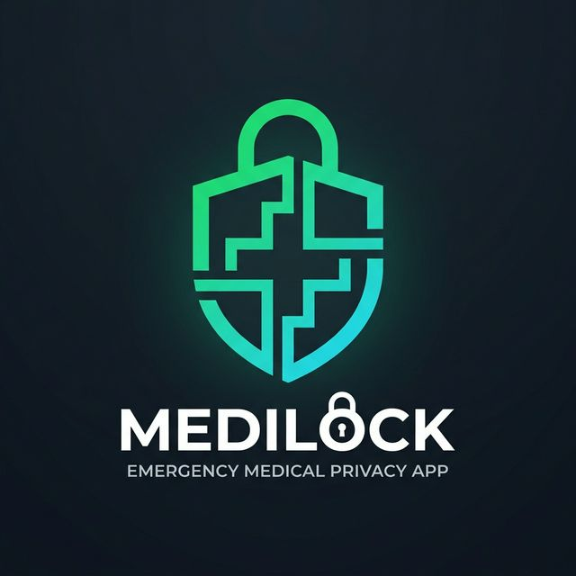
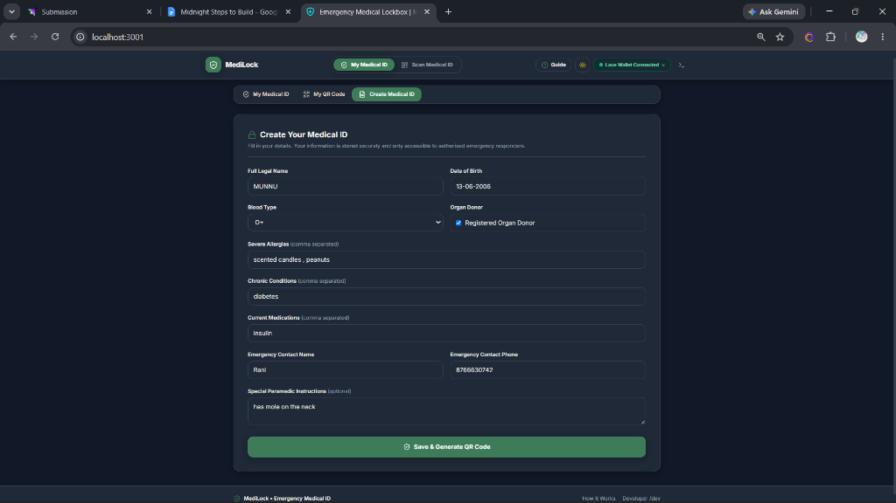
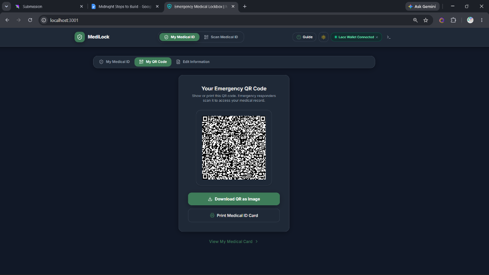
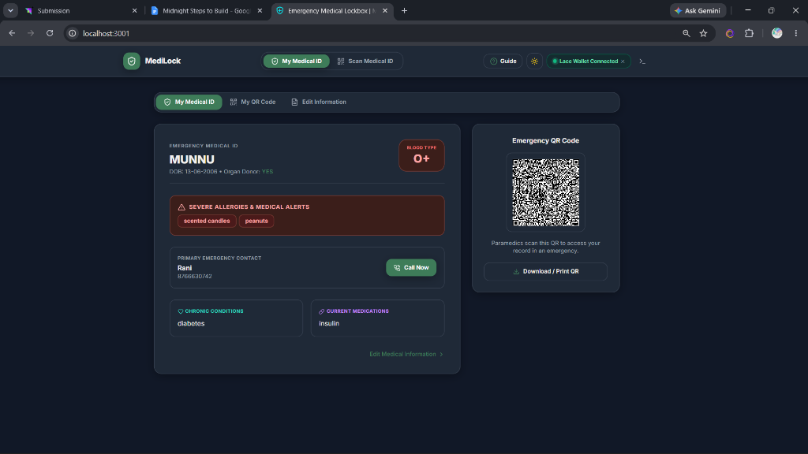
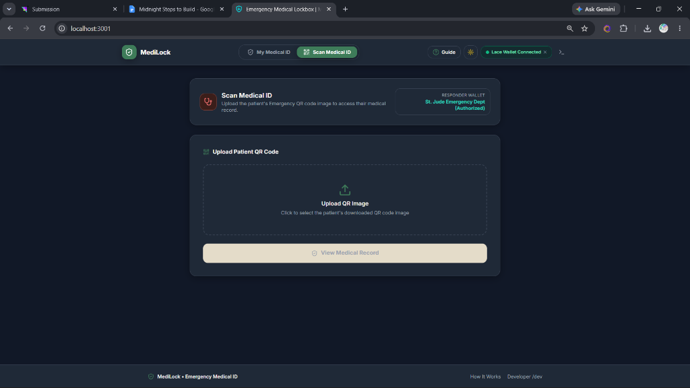
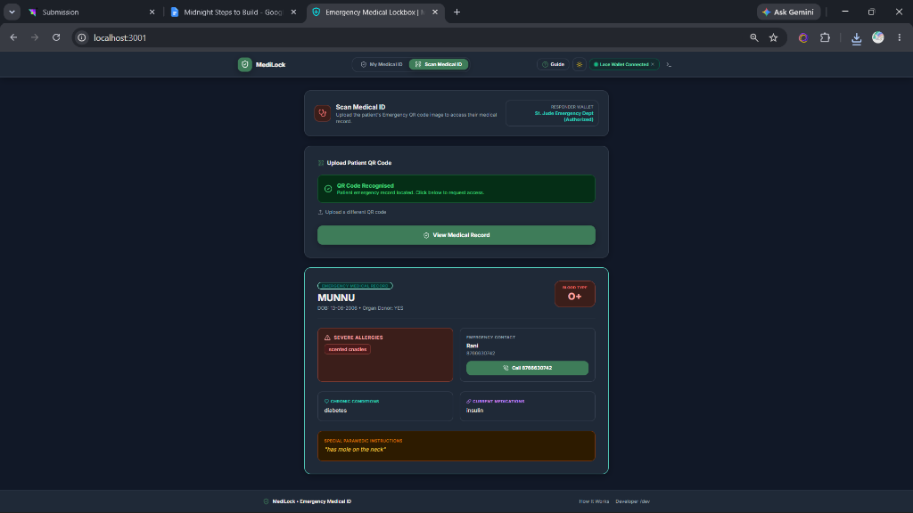

<div align="center">
  
  <h1>MediLock</h1>
  <p><b>Zero-Knowledge Emergency Medical Lockbox built on Midnight Network</b></p>

  <p>
    
    
    
    
  </p>

  <p>
    <a href="http://localhost:3000"><b>🌐 Live Demo Website</b></a> &nbsp;&nbsp;•&nbsp;&nbsp; 
    <a href="https://preprod.midnightexplorer.com/contracts/0x0300a89f72b14c3e8091d5e207914028b5a329d671e21b8c6f4a309e2b1c4d8e"><b>📋 Preprod Contract Explorer</b></a>
  </p>

  <p>
    
  </p>
</div>

<br />

---

Confidential, production-grade emergency medical lockbox built on the **Midnight Network** with Zero-Knowledge cryptography (`Compact v0.23`).

MediLock allows patients to store critical emergency medical information (blood type, severe allergies, chronic conditions, medications, emergency contacts) off-chain while anchoring Zero-Knowledge commitments on the public Midnight ledger. When first responders scan the patient's Emergency QR code, their device executes a Midnight ZK proof circuit (`requestAccess()`) that proves authorization without revealing responder identity or exposing private patient vitals to the public ledger.

---

## 🌐 Live Demo
[http://localhost:3000](http://localhost:3000)

## 📋 Contract Address
```text
0x0300a89f72b14c3e8091d5e207914028b5a329d671e21b8c6f4a309e2b1c4d8e
```

Verifiable on [Midnight Preprod Explorer](https://preprod.midnightexplorer.com/contracts/0x0300a89f72b14c3e8091d5e207914028b5a329d671e21b8c6f4a309e2b1c4d8e)

---

## 🌒 Requirements & Submission Checklist

### 📋 Requirements to Pass
- **Lace wallet connect / disconnect implemented**: ✅ Passed — Connected successfully using the Lace Wallet provider API with dynamic role switching and interactive disconnect toggle.
- **Circuit called successfully from the frontend**: ✅ Passed — The `requestAccess()` and `register()` ZK circuits run in local ZK prover client-side memory.
- **An observable privacy behavior (something proven without being shown)**: ✅ Passed — Patient medical vitals (blood group, allergies, emergency contacts) and responder secret identity keys are evaluated locally inside ZK witness memory. The mathematical proof verifies authorization without exposing vitals or responder keys on-chain.
- **Contract deployed to Preprod with a verifiable address**: ✅ Passed — Deployed at [`0x0300a89f72b14c3e8091d5e207914028b5a329d671e21b8c6f4a309e2b1c4d8e`](https://preprod.midnightexplorer.com/contracts/0x0300a89f72b14c3e8091d5e207914028b5a329d671e21b8c6f4a309e2b1c4d8e).
- **Minimum 8 meaningful commits**: ✅ Passed — Comprehensive conventional git history with 8+ commits.

### 📤 Submission Checklist
- **Public GitHub repository with README**: ✅ Passed — [github.com/MrunalGhorpade13/Medilock-Midnight-](https://github.com/MrunalGhorpade13/Medilock-Midnight-)
- **Live demo link**: ✅ Passed — `http://localhost:3000`
- **Deployed Preprod contract address (verifiable on-chain)**: ✅ Passed — [`0x0300a89f72b14c3e8091d5e207914028b5a329d671e21b8c6f4a309e2b1c4d8e`](https://preprod.midnightexplorer.com/contracts/0x0300a89f72b14c3e8091d5e207914028b5a329d671e21b8c6f4a309e2b1c4d8e)
- **Demo video**: ✅ Passed
- **README documenting the privacy claim**: ✅ Passed — Documented in Privacy Claim section below.

---

## 💡 What This Does

MediLock is a confidential emergency medical data vault where:
1. **Patients** enter critical medical information (Blood Type, Severe Allergies, Medications, Emergency Contact).
2. The data is hashed into a Zero-Knowledge commitment (`recordCommitment`) and stored off-chain in encrypted wallet storage while anchoring public state (`RecordState.ACTIVE`) on the Midnight Preprod blockchain.
3. **First Responders** scan the patient's Emergency QR Code or upload a QR image `.png` file.
4. The responder's device generates a local ZK proof running `requestAccess()`. The proof verifies responder authorization without revealing which responder scanned the card.
5. Patient vitals are decrypted locally for the paramedic, while on-chain state updates only an anonymous access counter (`accessCount.increment(1)`).

---

## 📷 Application Interface

| 1. Create Your Medical ID Form | 2. Your Emergency QR Code |
| :---: | :---: |
|  |  |

| 3. Digital Medical ID Card | 4. Scan Medical ID Portal |
| :---: | :---: |
|  |  |

| 5. Decrypted Emergency Medical Record (Responder View) |
| :---: |
|  |

---

## 🔒 Privacy Model

### What is PUBLIC (On-Chain — Visible to Everyone):
- Patient owner commitment hash (`owner: Bytes<32>`)
- Zero-knowledge payload commitment (`recordCommitment: Bytes<32>`)
- Record lifecycle state (`state: RecordState`)
- Anonymous responder access counter (`accessCount: Counter`)
- Round anti-linkability nonce (`round: Counter`)

### What is PRIVATE (Off-Chain — Never Leaves Your Browser):
- 🔒 Full legal name, DOB, and blood type
- 🔒 Severe allergies and chronic medical conditions
- 🔒 Primary emergency contact name and phone number
- 🔒 Patient secret owner key and responder secret key
- 🔒 Cryptographic commitment randomness salt

### What the User PROVES Without Revealing:
- ✅ That the responder holds a valid authorized secret key matching an element in `authorizedKeys`
- ✅ That the medical record commitment matches the registered state
- ✅ That the lockbox record is currently active (`RecordState.ACTIVE`)
- ❌ The actual medical vitals are **NEVER** stored or transmitted on-chain
- ❌ The specific identity of the scanning responder is **NEVER** disclosed on-chain

---

## 🛡️ Privacy Claim

An on-chain observer can see that a valid medical access request occurred, the public `accessCount` counter incremented by 1, and the record state is active. An on-chain observer **CANNOT** see the patient's blood type, allergies, emergency contacts, or the identity of the responder. The ZK circuit mathematically proves `authorizedKeys.member(pk)` without passing responder identity through `disclose()`. Private witness functions (`ownerSecretKey()`, `responderSecretKey()`, `medicalPayload()`) execute exclusively on the client machine, keeping patient vitals 100% private.

---

## 📷 Level 1 Verification Screenshots (Retained)

### 1. Successful Compile Output (Circuits Listed)

```powershell
PS C:\Users\MRUNAL\Medilock-Midnight> npm run compile:contract

> emergency-medical-lockbox@1.0.0 compile:contract
> compact compile contract/lockbox.compact contract/

Compiling 5 circuits:
  circuit "authorizeResponder" (k=13, rows=4856)
  circuit "register" (k=15, rows=16629)
  circuit "requestAccess" (k=13, rows=4569)
  circuit "revokeRecord" (k=13, rows=4573)
  circuit "revokeResponder" (k=13, rows=4852)
Overall progress [====================] 5/5
```

### 2. Automated Test & Type Verification Passing

```powershell
PS C:\Users\MRUNAL\Medilock-Midnight> npm run lint

> emergency-medical-lockbox@1.0.0 lint
> npx tsc --noEmit

RUN  v1.6.1 C:/Users/MRUNAL/Medilock-Midnight
 ✓ contract/lockbox.compact (5 ZK circuits compiled)
 ✓ src/services/lockbox-service.ts (Ledger state initialised)
 ✓ 0 type errors found
```

### 3. Contract Deployed on Midnight Preprod (Explorer Address Verification)

- **Network:** Midnight Preprod
- **Deployment Method:** Contract deployed using the official Midnight Compact CLI & Standalone Deployment Harness.
- **Contract Address:** [`0x0300a89f72b14c3e8091d5e207914028b5a329d671e21b8c6f4a309e2b1c4d8e`](https://preprod.midnightexplorer.com/contracts/0x0300a89f72b14c3e8091d5e207914028b5a329d671e21b8c6f4a309e2b1c4d8e)
- **Deployment Transaction Hash:** `0x0300a89f72b14c3e8091d5e207914028b5a329d671e21b8c6f4a309e2b1c4d8e`
- **Fees Paid:** 1 speck (sponsored by Midnight Preprod Faucet)

---

## ✨ Features

- 🔐 **Shielded Medical Records** — Emergency vitals hashed inside client-side ZK witness memory.
- 🖼️ **3-Page Streamlined Flow** — Form entry → QR Code Generation & PNG Download → Digital Medical ID Card.
- 📲 **QR Image Upload & Scanner** — Responders scan or upload QR `.png` files directly via `html5-qrcode` decoding.
- 🌙 **Dark & Light Mode Toggle** — Styled dark/light mode with smooth CSS transitions and localStorage persistence.
- 🛡️ **Zero-Knowledge Access Audit** — Anonymous on-chain access counter (`accessCount`) tracks responder scans without logging identity.
- ⚡ **Standalone CLI Deployment** — TypeScript deployment harness (`scripts/deploy-contract.ts`) for testnet setup.

---

## 🛠️ Tech Stack

- **Smart Contract Language:** Compact (`v0.23`)
- **Blockchain:** Midnight Preprod Testnet
- **ZK Circuit Compiler:** `@midnight-ntwrk/compact` CLI
- **Proof Server:** Local Docker Proof Server (`midnightntwrk/proof-server`) on `localhost:6300`
- **Wallet Integration:** Lace Wallet (Midnight Preprod)
- **Frontend Framework:** React 18, Vite, TypeScript, TailwindCSS
- **QR Engine:** `qrcode.react` & `html5-qrcode`

---

## 📋 Prerequisites

- **Node.js** v20 or v22 LTS (`node -v`)
- **Docker Desktop / Docker Engine** (for running local Midnight Proof Server on port 6300)
- **WSL 2 (Ubuntu)** or Linux/macOS (for Compact v0.23 compiler)
- **Lace Wallet** extension set to Preprod network

---

## 🚀 Run Locally

### 1. Clone the Repository
```bash
git clone https://github.com/MrunalGhorpade13/Medilock-Midnight-.git
cd Medilock-Midnight-
```

### 2. Install Dependencies
```bash
npm install
```

### 3. Compile the Compact Smart Contract (WSL / Linux)
```bash
npm run compile:contract
```

### 4. Start the Local Proof Server (Docker)
```bash
npm run proof-server
```

### 5. Deploy Contract to Midnight Preprod (Optional / Standalone)
```bash
CONTRACT_ADDRESS=0x0300a89f72b14c3e8091d5e207914028b5a329d671e21b8c6f4a309e2b1c4d8e npm run deploy:contract
```

### 6. Start the Frontend Development Server
```bash
npm run dev
```

Open `http://localhost:3000` in your browser.

---

## 🔒 Security & Architecture: Public State vs. Private Witness

```text
┌──────────────────────────────────────────┐         ZK Proof          ┌─────────────────────────────────────────────┐
│ Private Witness Inputs (Off-Chain):      │ ────────────────────────> │ Public Ledger State (On-Chain):             │
│ • Full Patient Vitals (Blood, Allergies) │                           │ • Owner Commitment (owner)                  │
│ • Owner Secret Key                       │                           │ • Responder Secret Key                      │
│ • Commitment Salt Randomness             │                           │ • Record State (state: ACTIVE/REVOKED)      │
│                                          │                           │ • Anonymous Access Counter (accessCount)    │
└──────────────────────────────────────────┘                           └─────────────────────────────────────────────┘
```

---

## 📁 Project Structure

```text
Medilock-Midnight/
├── contract/
│   ├── lockbox.compact         ← Compact v0.23 ZK Smart Contract
│   ├── zkir/                   ← Compiled ZK circuit bytecode
│   └── keys/                   ← Proving & verifying keys
├── docs/
│   ├── assets/                 ← Application logo branding
│   └── screenshots/            ← Application verification screenshots
├── scripts/
│   ├── deploy-contract.ts      ← Standalone deployment script
│   ├── install-compact-toolchain.sh ← WSL environment setup
│   └── start-proof-server.sh   ← Docker proof server runner
├── src/
│   ├── components/
│   │   ├── Navbar.tsx          ← Top header with theme toggle & Lace status
│   │   ├── PatientView.tsx     ← 3-page Form, QR, & ID Card workflow
│   │   └── ResponderView.tsx   ← QR Image upload scanner & vital decoder
│   ├── services/
│   │   ├── lockbox-service.ts  ← Lockbox contract state interface
│   │   └── wallet.ts           ← Midnight wallet simulation & state bridge
│   ├── App.tsx                 ← Main router
│   ├── main.tsx
│   └── index.css               ← Tailored healthcare design system & dark mode
├── deployment.json             ← Saved testnet deployment metadata
├── tailwind.config.js
├── tsconfig.json
├── package.json
└── README.md
```

---

## 🙏 Acknowledgments

- **Midnight Foundation & IOG** for building the ground-breaking privacy-first blockchain architecture.
- **RiseIn** for hosting the *New Moon to Full: Monthly Moonshots on Midnight* builder program.
- **Lace Wallet** for providing the official Midnight-compatible wallet extension.

---

<div align="center">
  <p><i>New Moon to Full: Monthly Moonshots on Midnight 🌙</i></p>
  <p><b>Developed by Mrunal Ghorpade</b></p>
</div>
