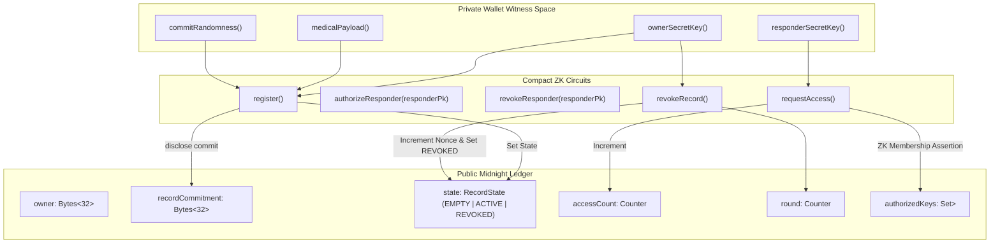
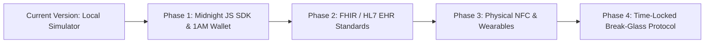

# Medilock-Midnight: Zero-Knowledge Emergency Medical Lockbox
## Complete Application Guide, Architecture Overview & Developer Documentation

---

### 1. Executive Summary & Purpose

#### **Why Medilock-Midnight Was Made**
In life-threatening medical emergencies (accidents, cardiac arrest, unconsciousness), emergency medical responders (paramedics, EMTs, ER physicians) require immediate, accurate medical history to make life-saving decisions. Vital information includes:
* **Blood Group** (prevents fatal transfusion errors)
* **Severe Allergies** (e.g., Penicillin, Latex, Anesthetics)
* **Chronic Conditions** (e.g., Type 1 Diabetes, Epilepsy, Pacemakers)
* **Current Medications** (prevents dangerous drug interactions)
* **Primary Emergency Contacts**
* **Organ Donor Preferences**

However, storing raw medical records in public databases or centralized servers exposes patients to extreme privacy risks, identity theft, unauthorized data harvesting, and tracking. 

#### **What It Is Made For**
**Medilock-Midnight** is a privacy-preserving **Emergency Medical Lockbox** built on the **Midnight Blockchain** using Zero-Knowledge (ZK) smart contracts written in **Compact**. It bridges the gap between emergency accessibility and absolute data privacy.

#### **Why It Is Helpful & Value Proposition**
1. **Off-Chain Shielded Storage**: Sensitive health data never touches the blockchain in plaintext. Raw payloads remain encrypted in local wallet storage.
2. **Zero-Knowledge On-Chain Commitment**: The public Midnight ledger only stores a 32-byte cryptographic commitment hash (`persistentCommit(payload, randomness)`) and an owner key commitment.
3. **Anonymous Responder Authorization**: Patients authorize trusted medical institutions (e.g., EMS squads, hospital ERs) by adding hashed responder keys to an on-chain `authorizedKeys` set.
4. **Anonymous Zero-Knowledge Access Proofs**: When a paramedic scans a patient's QR code, their wallet evaluates the [requestAccess()](file:///c:/Users/MRUNAL/Medilock-Midnight/src/services/lockbox-service.ts#62-65) ZK circuit, proving membership in `authorizedKeys` *without revealing which specific paramedic or hospital accessed the record*.
5. **Patient Sovereignty & Emergency Kill-Switch**: The patient retains total control. Executing [revokeRecord()](file:///c:/Users/MRUNAL/Medilock-Midnight/src/services/lockbox-service.ts#66-69) updates the contract state from `ACTIVE` to `REVOKED` and increments anti-linkability nonces, instantly cutting off all responder access.

---

### 2. Architecture & Technical Breakdown

#### **Technology Stack**
* **Smart Contract Language**: Compact (v0.16) compiled for the Midnight ZK Blockchain.
* **Frontend Framework**: React 18 + TypeScript + Vite.
* **Styling & UI**: Tailwind CSS with custom glassmorphism styling, dark mode, custom color tokens (`midnight`, `shield-cyan`, `shield-teal`, `shield-rose`, `shield-emerald`, `shield-purple`), and `lucide-react` iconography.
* **QR Scanning & Rendering**: `qrcode.react` (rendering high-density QR codes) and `html5-qrcode` (webcam/camera integration).
* **Cryptography & Simulation Engine**: Custom SHA-256/persistent hash and AES-GCM local payload encryption engine simulating Midnight JS SDK witnesses and Compact circuits.

#### **Compact Smart Contract Architecture ([contract/lockbox.compact](file:///c:/Users/MRUNAL/Medilock-Midnight/contract/lockbox.compact))**



#### **Core Compact Circuits**

| Circuit Name | Role | Witness Inputs (Private) | Ledger State Changes (Public) | ZK Guarantee |
| :--- | :--- | :--- | :--- | :--- |
| [constructor(ownerSk)](file:///c:/Users/MRUNAL/Medilock-Midnight/contract/lockbox-simulator.ts#39-42) | Instantiates contract | Owner Secret Key | Sets `state = EMPTY`, sets `owner` hash | Owner identity hidden |
| [register()](file:///c:/Users/MRUNAL/Medilock-Midnight/contract/lockbox-simulator.ts#71-128) | Creates/updates lockbox | `ownerSecretKey`, `medicalPayload`, `commitRandomness` | Sets `state = ACTIVE`, discloses `recordCommitment` | Payload remains 100% off-chain |
| [authorizeResponder(pk)](file:///c:/Users/MRUNAL/Medilock-Midnight/src/services/lockbox-service.ts#51-57) | Authorizes hospital/EMS | `ownerSecretKey` | Inserts `disclose(responderPk)` hash into `authorizedKeys` set | Only owner can authorize |
| [revokeResponder(pk)](file:///c:/Users/MRUNAL/Medilock-Midnight/src/services/lockbox-service.ts#58-61) | Removes hospital/EMS | `ownerSecretKey` | Removes `responderPk` from `authorizedKeys` set | Immediate access cutoff |
| [requestAccess()](file:///c:/Users/MRUNAL/Medilock-Midnight/src/services/lockbox-service.ts#62-65) | Paramedic access verification | `responderSecretKey` | Increments `accessCount` counter | Proves authorization without revealing responder identity |
| [revokeRecord()](file:///c:/Users/MRUNAL/Medilock-Midnight/src/services/lockbox-service.ts#66-69) | Emergency Kill-Switch | `ownerSecretKey` | Sets `state = REVOKED`, increments `round` nonce | Invalidate all prior proofs & unlink past transactions |

---

### 3. Application Features & UI Components

#### **1. Patient Emergency ID & Management Portal ([PatientView.tsx](file:///c:/Users/MRUNAL/Medilock-Midnight/src/components/PatientView.tsx))**
* **Emergency ID Card Tab**: Displays scannable Emergency QR code, patient summary, blood group badge, severe allergies highlight, and primary emergency contact.
* **Print / Export Capability**: One-click print format for physical wallet cards or emergency wristbands.
* **Lockbox Configuration Form**: Pure user-driven form to enter legal name, DOB, blood type, allergies, chronic conditions, medications, emergency contact, organ donor status, and special paramedic instructions.
* **Authorized Responders Set Manager**: Add hospital names and responder keys, or remove access with one click.
* **Scan Audit Logs**: Transparent access audit trail displaying timestamp, ZK proof status (`VERIFIED ZK` vs `REJECTED`), scan sequence number, and anonymous proof tag.
* **Emergency Kill-Switch Tab**: Red alert interface to trigger [revokeRecord()](file:///c:/Users/MRUNAL/Medilock-Midnight/src/services/lockbox-service.ts#66-69).

#### **2. Paramedic Emergency Portal ([ResponderView.tsx](file:///c:/Users/MRUNAL/Medilock-Midnight/src/components/ResponderView.tsx))**
* **QR Auto-Fill & Camera Scanner**: Reads Emergency QR payloads automatically populating contract address and commitment hash.
* **ZK Proof Evaluator ([requestAccess()](file:///c:/Users/MRUNAL/Medilock-Midnight/src/services/lockbox-service.ts#62-65))**: Initiates zero-knowledge circuit assertion.
* **Decrypted Emergency Card**: Displays vital medical details upon verified proof, including one-click direct phone dialer (`tel:`) for emergency contacts.
* **Rejection Shield**: Clear feedback when access is denied (e.g. unregistered wallet or revoked contract state).

#### **3. On-Chain Ledger Inspector ([LedgerInspector.tsx](file:///c:/Users/MRUNAL/Medilock-Midnight/src/components/LedgerInspector.tsx))**
* Drawer UI displaying live public state (`ownerCommitment`, `recordCommitment`, `state`, `accessCount`, `round`, `authorizedKeysCount`, `authorizedKeyHashes`).
* Demonstrates how observers on the public blockchain see cryptographic commitments without learning patient identity or health data.

#### **4. Wallet Role Simulator ([wallet.ts](file:///c:/Users/MRUNAL/Medilock-Midnight/src/services/wallet.ts) & Navbar)**
* Top dropdown lets users simulate 3 distinct wallet roles:
  1. **Patient Wallet** (`0x_patient_sk_9f8a...`)
  2. **Authorized Hospital / Paramedic** (`St. Jude General Hospital`)
  3. **Unregistered Paramedic** (`Unauthorized EMS Squad`)

---

### 4. Step-by-Step User & Testing Workflow

#### **How to Run the Application locally**
```bash
# Install dependencies
npm install

# Start Vite Development Server
npm run dev

# Run TypeScript Type Check & Linting
npm run lint

# Build Production Bundle
npm run build
```

#### **Testing Walkthrough**

##### **Test Scenario A: Patient Setup & Registration**
1. Open application in browser (`http://localhost:5173`).
2. Click **"Create Medical Lockbox"** (or switch to **"Edit Lockbox & Settings"**).
3. Fill out the medical form (e.g., Name: *Jane Doe*, Blood Type: *O-*, Allergies: *Penicillin*, Emergency Contact: *John Doe - 555-0199*).
4. Click **"Save & Shield Record on Midnight Ledger"**.
5. **Expected Result**: A ZK Proof Execution Modal appears confirming [register()](file:///c:/Users/MRUNAL/Medilock-Midnight/contract/lockbox-simulator.ts#71-128) circuit execution. State updates to `ACTIVE`. You are automatically redirected to the **Emergency ID Card** showing your scannable QR Code.

##### **Test Scenario B: Authorized Paramedic Access (Success Path)**
1. In the top navigation header, switch mode to **"Emergency Paramedic"**.
2. Notice the active wallet automatically switches to **"St. Jude General Hospital — Emergency Dept (Authorized)"**.
3. Click **"Auto-Fill From Patient QR"** (or scan using your device camera).
4. Click **"Request Access & Verify ZK Proof"**.
5. **Expected Result**: Circuit [requestAccess()](file:///c:/Users/MRUNAL/Medilock-Midnight/src/services/lockbox-service.ts#62-65) executes. ZK proof verifies `authorizedKeys` membership. Decrypted Emergency Record appears with blood group badge, red alert for severe allergies, and one-click contact calling. On-chain `accessCount` increments by 1.

##### **Test Scenario C: Unauthorized Paramedic Access (Rejection Path)**
1. In the top header wallet selector, pick **"Unregistered Paramedic (Unauthorized)"**.
2. Click **"Request Access & Verify ZK Proof"**.
3. **Expected Result**: Red alert banner: *"Zero-Knowledge Assertion Failed: Responder key is not authorized in authorizedKeys set."* Payload remains encrypted and inaccessible.

##### **Test Scenario D: Emergency Kill-Switch**
1. Switch back to **"Patient Mode"** -> Select **"Edit Lockbox & Settings"** -> Click **"Emergency Kill-Switch"** sub-tab.
2. Click **"EXECUTE REVOKE RECORD ()"**.
3. **Expected Result**: Contract state changes to `REVOKED` and `round` nonce increments.
4. Switch to **"Emergency Paramedic Mode"** with an Authorized Wallet and attempt access.
5. **Expected Result**: Access is blocked immediately because `state == RecordState.ACTIVE` assertion fails.

---

### 5. Roadmap & Enhancement Opportunities

For developers looking to extend and enhance **Medilock-Midnight**, here are high-impact enhancement vectors:



1. **Native Midnight JS SDK & 1AM Wallet Integration**:
   * Replace [lockbox-simulator.ts](file:///c:/Users/MRUNAL/Medilock-Midnight/contract/lockbox-simulator.ts) with the official Midnight JS SDK (`@midnight-ntwrk/midnight-js-contracts`) and connect to Midnight Testnet node via 1AM Wallet browser extension.
2. **FHIR / HL7 Data Standard Compatibility**:
   * Standardize the medical payload format into HL7 FHIR (Fast Healthcare Interoperability Resources) JSON format for direct interoperability with hospital electronic health record systems (Epic, Cerner).
3. **Hardware NFC / Emergency Bracelet Integration**:
   * Export the compact QR / commitment payload to passive NFC tags embedded in medical bracelets, smart watches, or wallet cards for tap-to-scan emergency access.
4. **Time-Bound Ephemeral Delegation**:
   * Add expiration timestamps (`validUntilRound`) to authorized responder keys so hospital authorizations auto-expire after 24-48 hours.
5. **Emergency Break-Glass Protocol with Notification Delay**:
   * Create a fallback circuit for unregistered EMS squads in extreme life-threatening scenarios: allows temporary access after a timed delay (e.g. 5 minutes) while broadcasting automated SMS/push alerts to emergency contacts.
6. **Multi-Patient Multi-Contract Factory**:
   * Implement a Compact factory pattern to allow healthcare networks to deploy managed lockbox contracts for thousands of patients seamlessly.

---
*Generated for Medilock-Midnight &bull; Built on Midnight Zero-Knowledge Blockchain*
